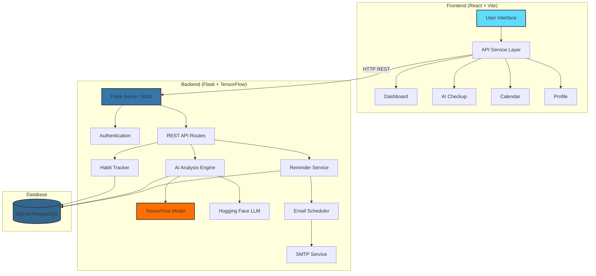
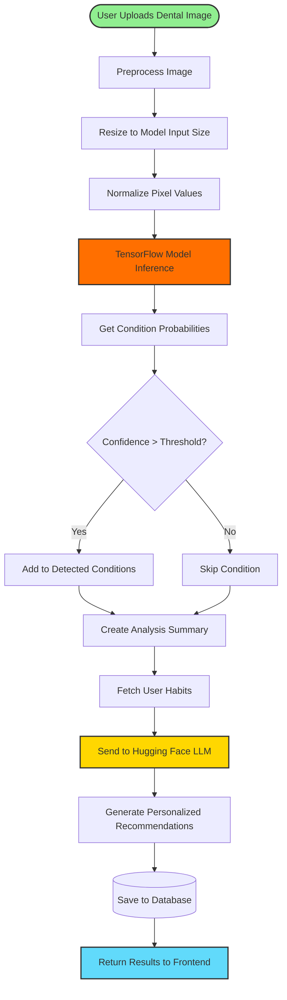
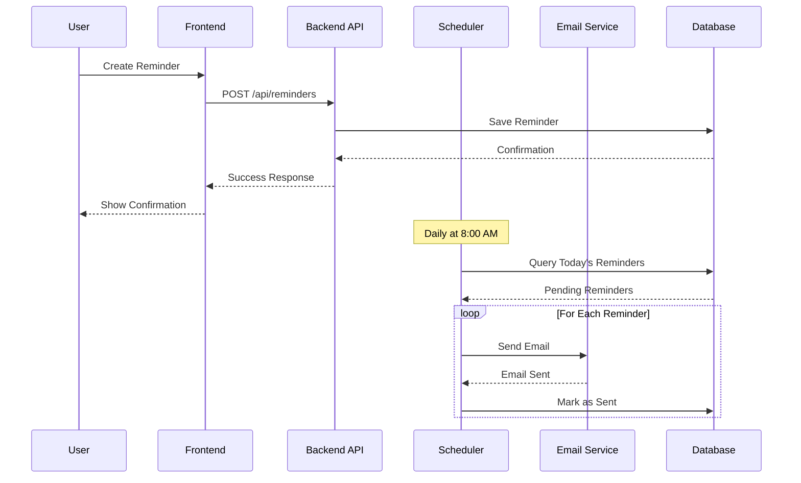
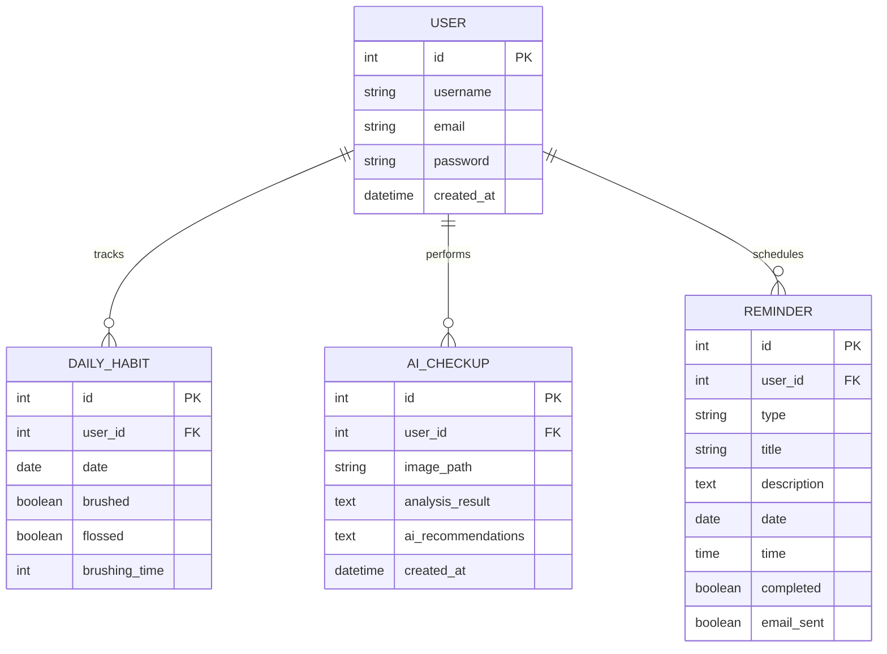

# Oral Health Tracker

A full-stack web application for tracking dental health habits, AI-powered dental disease detection, and personalized oral care recommendations. This tool combines machine learning with habit tracking to help users maintain optimal dental hygiene.

## Overview

This application helps users monitor their oral health through:

- **AI-Powered Dental Analysis** - Upload dental images for disease detection using TensorFlow
- **Daily Habit Tracking** - Log brushing and flossing activities with streak tracking
- **Smart Reminders** - Schedule appointments and medication reminders with email notifications
- **Personalized Recommendations** - Get AI-generated dental care advice via Hugging Face LLM
- **Visual Analytics** - Interactive charts showing habit history and progress

### What Makes It Different?

Unlike generic habit trackers, this application uses a trained deep learning model to analyze dental images and detect oral health conditions. Combined with daily habit tracking, it provides comprehensive, personalized recommendations to improve your dental health.

---

## Features

### Core Functionality
- **AI Dental Checkup** - Upload images for automated disease detection
- **Daily Habit Logging** - Track brushing time and flossing habits
- **Streak Tracking** - Visualize consistency with streak counters
- **Email Reminders** - Automated daily notifications at 8 AM
- **Appointment Scheduling** - Calendar-based reminder management

### User Interface
- **Modern Dashboard** - Clean, intuitive interface with daily stats
- **Interactive Calendar** - View and manage all reminders
- **Checkup History** - Review past AI analyses and recommendations
- **User Profiles** - Personalized experience with account management
- **Real-time Notifications** - Toast notifications for immediate feedback

### AI Features
- **Multi-condition Detection** - Identifies dental conditions from images
- **Confidence Scoring** - Shows prediction certainty for each condition
- **Contextual Recommendations** - Personalized advice based on habits and analysis
- **LLM Integration** - Hugging Face-powered detailed explanations

---

## Architecture

The application follows a **client-server architecture** with a React frontend and Flask backend powered by TensorFlow for AI inference.



### Component Overview

| Component | Technology | Purpose |
|-----------|-----------|---------|
| **Frontend** | React 18 + Vite | User interface and visualization |
| **Backend** | Flask + SQLAlchemy | REST API and business logic |
| **AI Model** | TensorFlow/Keras | Dental disease detection |
| **LLM** | Hugging Face Inference | Personalized recommendations |
| **Scheduler** | APScheduler | Automated email reminders |
| **Database** | SQLite/PostgreSQL | Data persistence |

---

## How It Works

### AI Analysis Pipeline



### Reminder System Flow



### Data Models



---

## Installation

### Prerequisites

- **Node.js** (v18 or higher)
- **npm** (v9 or higher)
- **Python** (v3.11 or higher)
- **pip** (Python package manager)

### Step 1: Clone the Repository

```bash
git clone <repository-url>
cd dtl
```

### Step 2: Install Backend Dependencies

```bash
cd backend
pip install -r requirements.txt
```

### Step 3: Install Frontend Dependencies

```bash
cd ../frontend
npm install
```

### Step 4: Configure Environment Variables

Create a `.env` file in the `backend` directory:

```env
# Database
DATABASE_URL=sqlite:///dental_tracker.db

# Session
SECRET_KEY=your-secret-key-here

# Email Configuration (for reminders)
MAIL_SERVER=smtp.gmail.com
MAIL_PORT=587
MAIL_USE_TLS=True
MAIL_USERNAME=your-email@gmail.com
MAIL_PASSWORD=your-app-password
MAIL_DEFAULT_SENDER=your-email@gmail.com

# Hugging Face (for AI recommendations)
HUGGINGFACE_API_KEY=your-huggingface-api-key
```

---

## Usage

### Starting the Application

You need to run **both** the backend server and the frontend development server.

#### Terminal 1: Start Backend Server

```bash
cd backend
python app.py
```

You should see:
```
✓ Email reminder scheduler initialized
 * Running on http://0.0.0.0:5000
```

#### Terminal 2: Start Frontend

```bash
cd frontend
npm run dev
```

You should see:
```
VITE v4.4.0  ready in 500 ms

➜  Local:   http://localhost:5173/
➜  Network: use --host to expose
```

### Accessing the Application

Open your browser and navigate to:
```
http://localhost:5173
```

### Using the Application

1. **Create an Account** - Sign up with username, email, and password
2. **Log Daily Habits** - Track brushing and flossing on the Dashboard
3. **AI Checkup** - Upload a dental image for AI analysis
4. **View Recommendations** - Get personalized oral care advice
5. **Set Reminders** - Schedule appointments and medication reminders
6. **Track Progress** - View your streak and habit history

---

## Technologies Used

### Frontend
- **React 18** - UI framework with hooks
- **Vite** - Fast build tool and dev server
- **React Router** - Client-side routing
- **Chart.js** - Data visualization
- **Axios** - HTTP client
- **React Hot Toast** - Toast notifications
- **React Icons** - Icon library

### Backend
- **Flask** - Python web framework
- **Flask-SQLAlchemy** - ORM for database
- **Flask-CORS** - Cross-origin support
- **Flask-Mail** - Email functionality
- **Werkzeug** - Password hashing
- **APScheduler** - Background job scheduler
- **Gunicorn** - Production WSGI server

### Machine Learning
- **TensorFlow/Keras** - Deep learning framework
- **Pillow** - Image preprocessing
- **Hugging Face Hub** - LLM inference API
- **NumPy** - Numerical computations

### Deployment
- **Docker** - Containerization
- **Railway** - Cloud hosting platform

---

## Deployment

### Docker Deployment

Build and run with Docker:

```bash
docker build -t oral-health-tracker .
docker run -p 5000:5000 oral-health-tracker
```

### Railway Deployment

The project includes Railway configuration files:

```bash
# Install Railway CLI
npm install -g @railway/cli

# Login and deploy
railway login
railway up
```

---

## Development

### Building the Frontend

```bash
cd frontend
npm run dev     # Start dev server
npm run build   # Build for production
npm run preview # Preview production build
```

### Running the Backend

```bash
cd backend
python app.py        # Development mode
gunicorn app:app     # Production mode
```

### Project Structure

```
dtl/
├── backend/
│   ├── app.py              # Main Flask application
│   ├── models.py           # SQLAlchemy models
│   ├── ai_service.py       # AI recommendation service
│   ├── model_integration.py # TensorFlow model wrapper
│   ├── email_service.py    # Email functionality
│   ├── scheduler.py        # APScheduler setup
│   ├── model/              # TensorFlow model files
│   └── requirements.txt    # Python dependencies
├── frontend/
│   ├── src/
│   │   ├── components/     # React components
│   │   ├── api/            # API service layer
│   │   └── styles/         # CSS stylesheets
│   ├── package.json        # Node dependencies
│   └── vite.config.js      # Vite configuration
├── Dockerfile              # Container configuration
├── docker-compose.yml      # Multi-container setup
└── railway.toml            # Railway deployment config
```

---

## API Endpoints

| Method | Endpoint | Description |
|--------|----------|-------------|
| POST | `/api/register` | Create new user account |
| POST | `/api/login` | Authenticate user |
| POST | `/api/logout` | End user session |
| GET | `/api/profile` | Get user profile |
| GET | `/api/check-auth` | Verify authentication |
| GET/POST | `/api/habits/today` | Get/update today's habits |
| GET | `/api/habits/streak` | Get current streak |
| GET | `/api/habits/history` | Get habit history |
| POST | `/api/ai-checkup` | Upload image for AI analysis |
| GET | `/api/checkups/history` | Get checkup history |
| GET | `/api/checkups/<id>` | Get specific checkup details |
| GET/POST | `/api/reminders` | List/create reminders |
| PUT/DELETE | `/api/reminders/<id>` | Update/delete reminder |
| GET | `/api/reminders/upcoming` | Get upcoming reminders |

---

## Contributing

1. Fork the repository
2. Create a feature branch (`git checkout -b feature/amazing-feature`)
3. Commit your changes (`git commit -m 'Add amazing feature'`)
4. Push to the branch (`git push origin feature/amazing-feature`)
5. Open a Pull Request

---

## License

This project is licensed under the MIT License.
